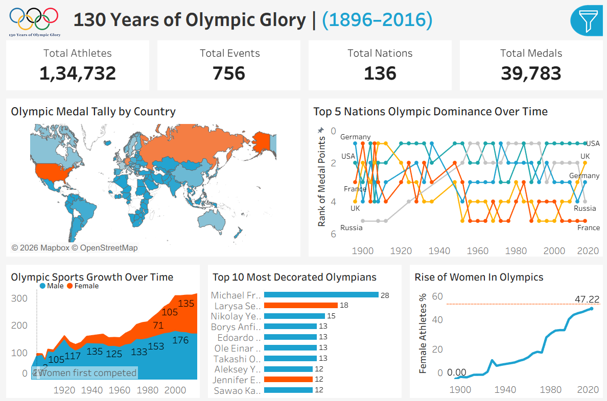
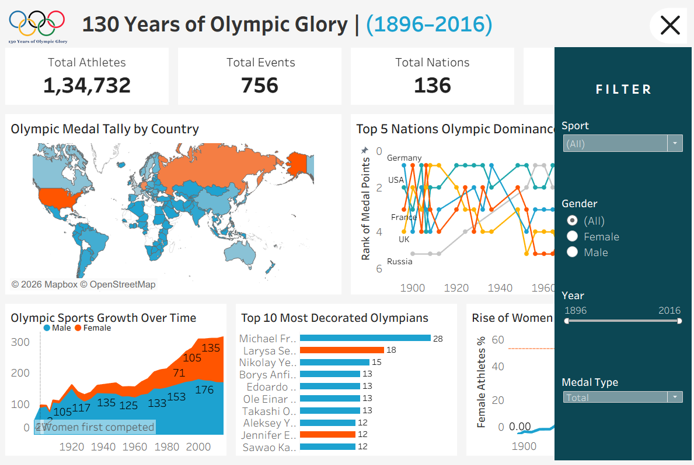

# 🏅 130 Years of Olympic Glory (1896–2016)

An interactive Tableau dashboard analyzing 120+ years 
of Olympic Games history.

## 📊 Dashboard Link
- Click here to [View Live Dashboard](https://public.tableau.com/app/profile/muhammed.ar1912/viz/olympics_17780628633460/OLYMPICS_DASHBOARD)

## 📸 Screenshot

## 📈 Key Metrics
| Metric | Value |
|---|---|
| Total Athletes | 134,732 |
| Total Nations | 207 |
| Total Events | 765 |
| Total Medals | 39,783 |

## 📊 Charts Included
- 🗺️ Olympic Medal Tally World Map
- 📈 Country Dominance Bump Chart
- 📊 Olympic Sports Growth Timeline
- 🏅 Top 15 Most Decorated Olympians
- 👫 Rise of Women in Olympics

## 🔍 Interactive Filters
- Sport
- Gender
- Year Range (1896–2016)
- Medal Type (Gold/Silver/Bronze/Total)

## 🛠️ Tools Used
- Tableau Public 2025
- Dataset: Kaggle — 120 Years of Olympic History

## 💡 Key Insights
- USA has dominated Olympics for 100+ years
- Female participation grew from 0% to 45%
- Michael Phelps has more medals than most countries

## 👤 Author
Muhammed Abdul Razak
-[Tableau Public Profile](https://public.tableau.com/app/profile/muhammed.ar1912)
-[LinkedIn](http://linkedin.com/in/muhammed-abdulrazak)
